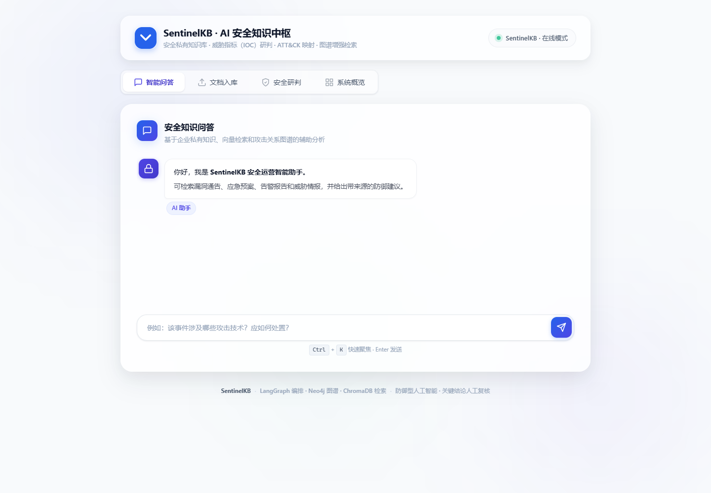
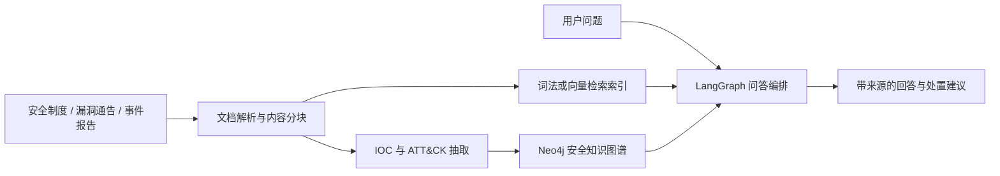

# SentinelKB · AI 安全知识中枢

SentinelKB 是面向 SOC、安全运营和应急响应场景的中文 **AI + 网络安全** 私有知识库。它把漏洞通告、安全制度、告警报告和威胁情报转为可检索、可关联、可追溯的安全知识。

## 你可以用它做什么

- 上传安全文档，自动分块、抽取实体关系并写入检索库与 Neo4j 图谱。
- 对告警或事件描述提取 IP、域名、URL、CVE、Hash、邮箱等 IOC。
- 将攻击迹象映射到 MITRE ATT&CK 技术并生成风险分数和防御性处置清单。
- 通过向量检索 + 本地词法兜底 + 图谱检索回答安全问题，并展示来源。
- 通过 LangGraph 编排文档入库、问答和增量更新流程。

> 定位边界：这是辅助研判系统，不替代 EDR/SIEM，也不会自动执行封禁、隔离等高风险操作。



## 项目状态

| 检查项 | 当前结果 |
|---|---|
| Python 自动化测试 | 27 项全部通过 |
| 在线 RAG 固定评测 | 10/10 通过 |
| 关键事实覆盖率 | 100% |
| 来源命中率 | 100% |
| 无答案拒答准确率 | 100% |
| 端到端验收 | 健康检查、问答、研判、检索和 Neo4j 全部通过 |

详细数据见 [RAG 评测报告](docs/evaluation/rag_eval_latest.md) 和 [项目验收报告](docs/项目验收报告.md)。固定演示集结果不等同于生产环境准确率。

## 业务链路



## 目录导航

- `code/`：可运行代码与 Docker 编排。
- `code/samples/security_incident.txt`：开箱演示样例。
- `evals/`：检索评测数据与离线基线报告。
- `code/python/evaluation/`：可重复执行的在线 RAG 验收集与评测脚本。
- `docs/evaluation/`：最近一次在线 RAG 评测的 JSON 原始结果与 Markdown 报告。
- `docs/`：架构、接口和交付文档。

## 最快启动

环境要求：Windows 10/11、Python 3.12 和使用 WSL 2 后端的 Docker Desktop。

首次运行先在项目根目录安装依赖：

```powershell
py -3.12 -m venv .venv
.\.venv\Scripts\python.exe -m pip install -r code\python\requirements-dev.txt
```

然后：

1. 启动 Docker Desktop。
2. 双击根目录的 `启动项目.cmd`（脚本会启动并等待 Neo4j 就绪，然后启动 FastAPI）。
3. 打开 <http://localhost:8080>；接口文档位于 <http://localhost:8080/docs>。
4. 打开 <http://localhost:8080/api/health>，看到 `status: ok` 即启动成功。

关闭时先在 API 终端按 `Ctrl+C`，再双击 `关闭项目.cmd`。关闭脚本只停止容器，不删除 Neo4j 数据卷，下一次启动仍保留图谱数据。

需要快速确认全部核心功能时，在项目运行期间双击 `验收项目.cmd`。它会自动检查健康状态、知识问答、安全研判、检索索引和 Neo4j 图谱，并逐项输出 `PASS`。

项目默认支持**离线模式**，没有大模型 API Key 也能完成文档入库、词法检索、安全规则研判、IOC/ATT&CK 抽取和 Neo4j 图谱写入。配置真实 OpenAI 兼容服务后，才启用大模型抽取和生成式回答。

即使 `.env` 已保存 API Key，项目也不会自动联网。只有在确认 Base URL 与模型名正确后显式设置 `ENABLE_LLM=1`，才会启用大模型调用；`DISABLE_LOCAL_EMBEDDINGS=0` 则单独控制在线 Embedding。

`启动项目.cmd` 会直接采用 `.env` 中的模式开关，不会覆盖 `ENABLE_LLM` 或 `DISABLE_LOCAL_EMBEDDINGS`。修改 `.env` 后必须停止并重新启动 API，健康页才会显示新的运行模式。

### 国内模型服务配置

项目兼容提供 OpenAI 风格接口的国内模型平台和中转站。推荐先采用“在线对话 + 本地词法检索”，避免因服务商没有 Embedding 权限导致入库失败：

```env
OPENAI_API_KEY=请填写自己的密钥
OPENAI_BASE_URL=https://服务商提供的接口地址/v1
OPENAI_MODEL=服务商控制台中的准确模型名称
ENABLE_LLM=1
DISABLE_LOCAL_EMBEDDINGS=1
```

修改 `code/python/.env` 后必须重启项目。详细说明见 [国内模型服务配置指南](docs/国内模型服务配置指南.md)。任何真实 API Key 都不能写入 README、截图、代码或 Git 提交。

### 最短验收流程

1. 在“文档入库”上传 `code/samples/rag_test.txt`。
2. 询问：`针对蓝隼项目 SEC-731，发现 Mimikatz 后需要检查哪些记录？`
3. 答案应包含 `10.20.30.40`、EDR、Windows 登录日志和 SMB 访问记录，且来源仅为 `rag_test.txt`。
4. 再次上传同一文件，应立即显示“相同内容已存在”，索引和图谱数量不再增加。

入库使用文件内容哈希作为文档 ID。Neo4j 采用带短暂断连重试的原子事务，只有图谱事务成功后才会提交检索索引，从而避免重复上传和半成功数据。

本机调试也可以只启动 Neo4j，再在 `code/python` 中安装依赖并执行：

```powershell
python -m uvicorn api.main:app --host 0.0.0.0 --port 8080 --reload
```

若只验证离线安全研判算法，不需要 LLM 或 Docker：

```powershell
cd code/python
python -m pytest tests/test_security_analysis_agent.py -q
```

### 在线 RAG 评测

项目运行并完成样例文档入库后，在 `code/python` 执行：

```powershell
python -m evaluation.runner --skip-upload
```

首次运行或需要自动补齐测试文档时，去掉 `--skip-upload`。评测固定覆盖事实问答、来源命中、跨文档隔离和知识库无答案拒答，并以 1 秒间隔请求；遇到 429、502 或超时会有限重试，重试次数和最终 API 错误都会写入报告。

当前在线基线为 10/10 通过：关键事实覆盖率、来源命中率、拒答准确率均为 100%，P50 约 3.0 秒，P95 约 20.5 秒。详细结果见 `docs/evaluation/rag_eval_latest.md`；延迟会随所用模型服务和中转站变化。

## 核心改造（相对原项目）

| 改造 | 实际效果 |
|---|---|
| SecurityAnalysisAgent | 确定性 IOC 提取、ATT&CK 映射、风险评分、处置建议 |
| `/api/security/analyze` | 独立安全研判 API，可离线运行核心规则 |
| 安全文档入库 | 文档入库响应附带风险等级、IOC 数和攻击技术数 |
| 真实检索兜底 | 修复原 Chroma 路径只计数不检索的问题；无 Embedding 时使用持久化词法索引 |
| 上传加固 | 扩展名白名单、25 MB 限制、路径净化、随机存储名 |
| 图查询加固 | 模型生成的 Cypher 只能执行 MATCH/RETURN 只读查询 |
| 产品界面 | 增加安全研判工作台和安全运营指标，完成 SentinelKB 品牌化 |
| 离线知识图谱 | 无 API Key 时按安全规则生成事件、IOC、ATT&CK 节点及关系并写入 Neo4j |
| 自动化测试 | 27 项测试覆盖安全分析、离线工作流、API、幂等入库和 RAG 评测指标 |

## 技术栈

Python 3.12、FastAPI、LangGraph、LangChain、ChromaDB、Neo4j、原生 HTML/CSS/JavaScript、Pytest、Docker Compose；PGVector 和 Kafka 为可选扩展。

## 真实限制

- 离线模式的回答是可追溯原文片段，不是大模型生成答案；生成式问答需要配置兼容 OpenAI 的模型服务。
- 规则风险分数是处置优先级启发式，不等同于 CVSS、EDR 定级或正式事件结论。
- ATT&CK 映射目前覆盖常见演示场景，生产使用需扩充规则、版本管理和人工反馈闭环。
- 生产部署还应补充身份认证、租户隔离、密钥托管、审计日志、恶意文件沙箱和内容安全策略。

## 建议阅读顺序

`README` → 启动项目 → 跑通样例 → 查看验收报告与 RAG 评测 → 按业务链路阅读核心代码。

启动失败、模型接口报错、文档长时间处理中和 Neo4j 登录等问题见 [常见问题](docs/常见问题.md)。
